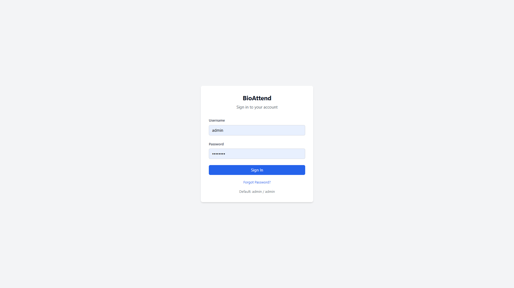
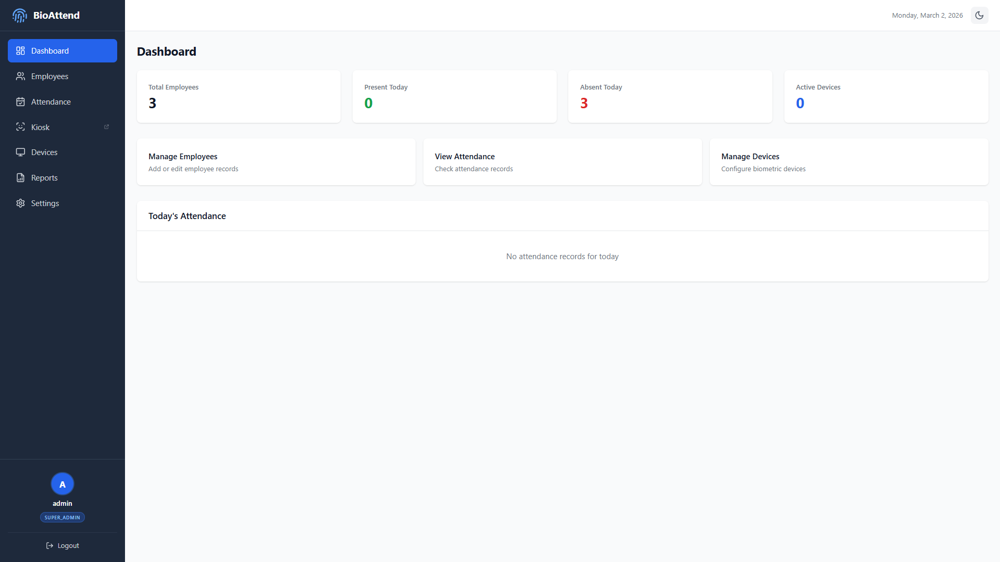
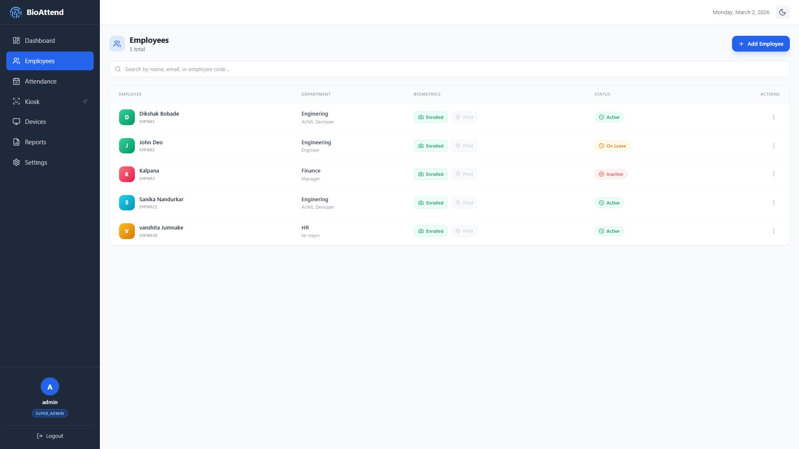
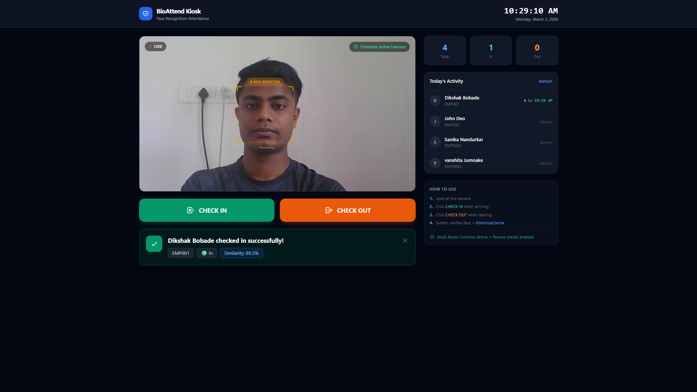
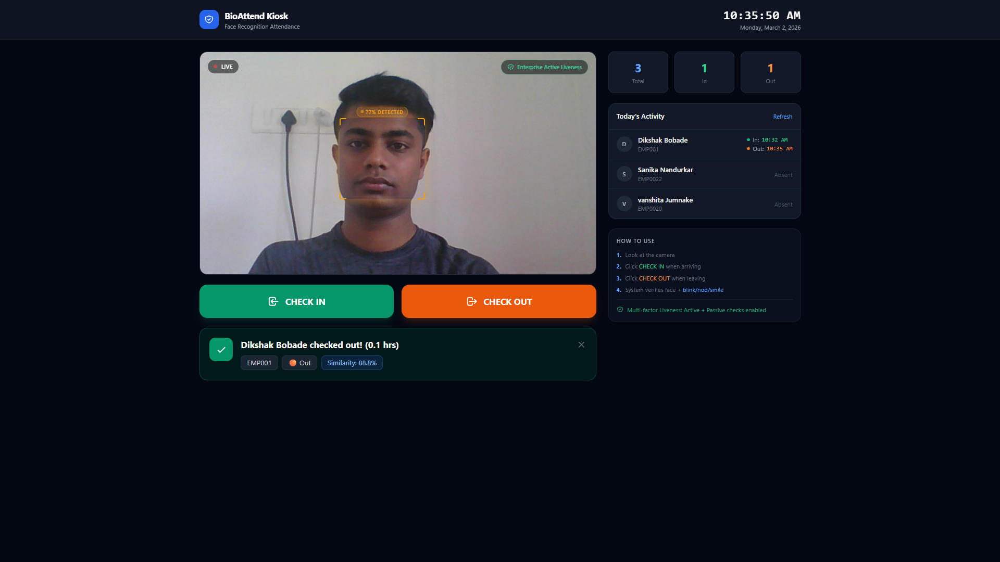
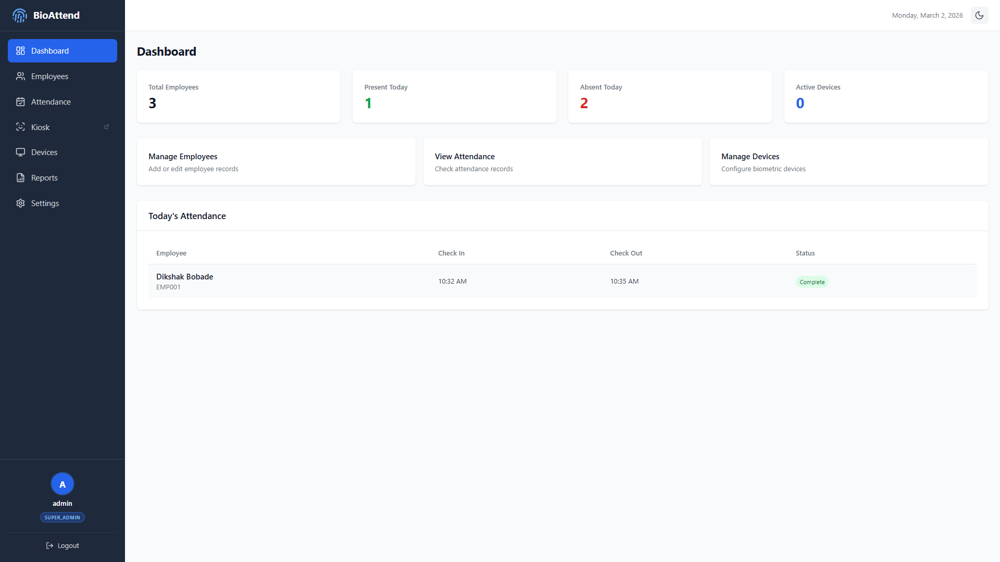

# 🔐 BioAttend — AI-Powered Biometric Attendance System

<div align="center">


**Enterprise-grade face recognition attendance system with real-time liveness detection, anti-spoofing, and complete admin dashboard.**

[Features](#-features) • [Screenshots](#-screenshots) • [Tech Stack](#-tech-stack) • [Setup](#-quick-setup) • [Architecture](#-architecture) • [License](#-license)

</div>

---

## 🎯 Overview

BioAttend is a production-ready biometric attendance system that replaces traditional punch cards and manual registers with **AI-powered face recognition**. Employees simply look at the kiosk camera to check in/out — no cards, no PINs, no manual entries.

**Key Achievement:** Face recognition with **88–90% similarity accuracy**, enterprise-grade liveness detection, and complete attendance lifecycle management.

---

## ✨ Features

### 🎭 Face Recognition & Liveness
- **Real-time face detection** using InsightFace (ArcFace model)
- **Enterprise Active Liveness Detection** — blink, nod, or smile verification
- **Anti-spoofing** — rejects photos and video replay attacks
- **512-dimensional encrypted face embeddings** — privacy-first, GDPR compliant
- Face similarity scoring displayed on every check-in/out

### 👥 Employee Management
- Add, edit, and manage employees with department/role assignment
- Biometric enrollment directly from admin panel
- Employee status tracking — Active, On Leave, Inactive
- Print employee ID cards

### 📊 Admin Dashboard
- Live attendance stats — Present, Absent, Total employees
- Today's attendance log with check-in/check-out times
- Full attendance history and reports
- Multi-admin support with role-based access (SUPER_ADMIN, ADMIN)

### 🖥️ Kiosk Mode
- Dedicated fullscreen kiosk page for office entrance
- LIVE camera feed with face detection overlay
- One-tap CHECK IN / CHECK OUT
- Real-time activity sidebar — see who's in/out instantly
- Works on any PC with a webcam

### 🐳 Docker Ready
- Full Docker Compose setup (Backend + Frontend + MySQL)
- Production-ready containerization
- Easy deployment on any server

---

## 📸 Screenshots

### Login Page


### Admin Dashboard

*Real-time attendance stats — 1 Present, 2 Absent after face scan*

### Employee Management

*All employees listed with biometric enrollment status*

### Kiosk — Check In (89.5% Similarity)

*"Dikshak Bobade checked in successfully!" with 89.5% face similarity score*

### Kiosk — Check Out (88.8% Similarity)

*Automatic check-out detection with session duration tracking*

### Dashboard After Attendance

*Dashboard updates in real-time after face scan*

---

## 🛠️ Tech Stack

| Layer | Technology |
|-------|-----------|
| **Frontend** | React 18, Tailwind CSS, Vite |
| **Backend** | FastAPI, Python 3.10+ |
| **Face AI** | InsightFace (ArcFace), OpenCV |
| **Liveness** | Multi-factor Active + Passive detection |
| **Database** | MySQL 8 (Docker) / SQLite (local) |
| **ORM** | SQLAlchemy + Alembic migrations |
| **Auth** | JWT tokens, bcrypt password hashing |
| **Security** | Fernet encryption for face embeddings |
| **Deployment** | Docker, Docker Compose |

---

## ⚡ Quick Setup

### Prerequisites
- Python 3.10+
- Node.js 18+
- Docker & Docker Compose (for production)
- Webcam

### Option 1: Local Development (Recommended for Testing)

```bash
# Clone the repository
git clone https://github.com/dikshakbobade/BioAttend.git
cd BioAttend

# Backend setup
cd backend
python -m venv .venv
.venv\Scripts\activate        # Windows
# source .venv/bin/activate   # Linux/Mac
pip install -r requirements.txt

# Start backend
uvicorn main:app --reload --port 8000

# Frontend setup (new terminal)
cd frontend
npm install
npm run dev
```

Open `http://localhost:3000` — Login with `admin / admin`

### Option 2: Docker Production Deployment

```bash
# Clone and configure
git clone https://github.com/dikshakbobade/BioAttend.git
cd BioAttend

# Create .env file (copy from .env.example and fill in values)
cp .env.example .env

# Start all services
docker-compose up -d

# Run database migrations
docker exec bioattend_backend alembic upgrade head
```

Open `http://<YOUR_SERVER_IP>:3000`

---

## 🗂️ Project Structure

```
BioAttend/
├── backend/
│   ├── main.py                 # FastAPI app entry point
│   ├── models/                 # SQLAlchemy database models
│   ├── routers/                # API route handlers
│   │   ├── auth.py             # Authentication endpoints
│   │   ├── employees.py        # Employee management
│   │   ├── attendance.py       # Attendance tracking
│   │   └── biometrics.py       # Face enrollment & recognition
│   ├── services/
│   │   ├── face_recognition.py # InsightFace integration
│   │   └── liveness.py         # Anti-spoofing detection
│   ├── alembic/                # Database migrations
│   ├── requirements.txt
│   └── Dockerfile
├── frontend/
│   ├── src/
│   │   ├── pages/
│   │   │   ├── Dashboard.jsx
│   │   │   ├── Employees.jsx
│   │   │   ├── Kiosk.jsx       # Face recognition kiosk
│   │   │   └── Attendance.jsx
│   │   └── components/
│   ├── package.json
│   └── Dockerfile
├── docs/
│   └── screenshots/            # Project screenshots
├── docker-compose.yml
├── .env.example
├── .gitignore
├── LICENSE
└── README.md
```

---

## 🔒 Security & Privacy

- **Face embeddings are never stored as photos** — only encrypted 512-dimensional mathematical vectors
- Embeddings encrypted with **Fernet symmetric encryption** before database storage
- **Cannot reverse-engineer** face images from stored embeddings
- **PDPB/GDPR compliant** biometric data handling
- JWT-based session authentication with expiry
- bcrypt password hashing for admin accounts

---

## 🏗️ Architecture

```
┌─────────────────┐     ┌──────────────────┐     ┌─────────────┐
│   React Frontend │────▶│  FastAPI Backend  │────▶│  MySQL DB   │
│   (Port 3000)   │     │   (Port 8000)    │     │ (Port 3306) │
└─────────────────┘     └──────────────────┘     └─────────────┘
                                │
                    ┌───────────┴───────────┐
                    │                       │
             ┌──────▼──────┐       ┌────────▼──────┐
             │  InsightFace │       │   Liveness    │
             │  (ArcFace)  │       │  Detection    │
             └─────────────┘       └───────────────┘
```

---

## 📋 API Endpoints

| Method | Endpoint | Description |
|--------|----------|-------------|
| POST | `/api/auth/login` | Admin login |
| GET | `/api/employees` | List all employees |
| POST | `/api/employees` | Add new employee |
| POST | `/api/biometrics/enroll` | Enroll face biometric |
| POST | `/api/attendance/checkin` | Face recognition check-in |
| POST | `/api/attendance/checkout` | Face recognition check-out |
| GET | `/api/attendance/today` | Today's attendance records |
| GET | `/api/reports/attendance` | Full attendance report |

---

## 🤝 Contributing

1. Fork the repository
2. Create your feature branch (`git checkout -b feature/AmazingFeature`)
3. Commit your changes (`git commit -m 'Add AmazingFeature'`)
4. Push to the branch (`git push origin feature/AmazingFeature`)
5. Open a Pull Request

---

## 👨‍💻 Author

**Dikshak Bobade**
- GitHub: [@dikshakbobade](https://github.com/dikshakbobade)
- B.Tech Data Science

---

## 📄 License

This project is licensed under the **MIT License** — see the [LICENSE](LICENSE) file for details.

---

<div align="center">
⭐ Star this repo if you found it helpful!
</div>
